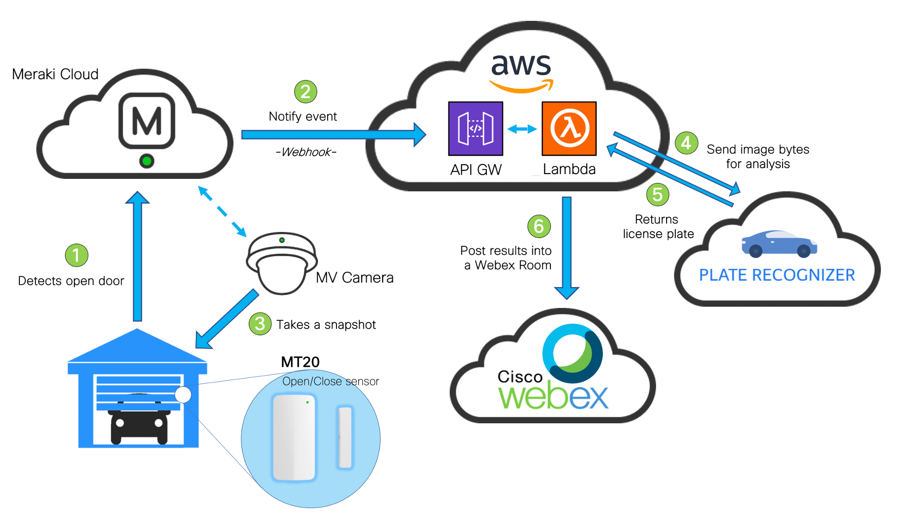
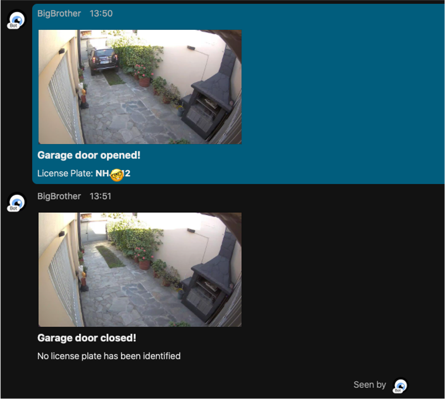

# Meraki License Plate Detector

## Description

This projects integrates Meraki MV Cameras, MT Sensors and Plate Recognizer software to detect when a garage door is opened to take a snapshot, and detect vehicle license plates.

### Workflow

The workflow will be the following:



## Before start: What do you need

1. Access to a Meraki Dashboard (and its API key) with an **MV Camera** and an **MT20 Sensor**.

2. An **AWS Account**.

3. A **Webex** account. You will need it to create a Bot and grab its Access Token. You'll find instructions on how to do it [here](https://developer.webex.com/docs/bots#creating-a-webex-bot).

4. A [Plate Recognizer](https://platerecognizer.com/) account. Free tier available (2500 API calls/month).

## Usage

1. Clone this repo in your local machine typing on your terminal:

```https://github.com/agmanuelian/Meraki_License_Plate_Detector.git```

2. Install the required dependencies specified on the _requirements.txt_ file:

```pip3 install requirements.txt```

3. On you AWS account, set up your **Lambda Function**. When it's time to upload your code, zip the *lambda_module* directory, and upload the .zip file. Before you do this, be sure to update all your credentials in the *lambda_module/main_plate.py* file.

#### Lambda Setup - Step 1

Here you will find an example workflow on how to setup you Lambda function. Replace "facemask" with a relevant name for this project i.e "plate_recognizer"


After you do this, increase the execution time up to 15 seconds, under the Configuration tab.

#### Lambda Setup - Step 2


4. On you AWS account, set up your **API Gateway**. Once deployed, grab its public address. You will need it on the next step.

#### API Gateway Setup - Step 1

Here you will find an example workflow on how to setup you API Gateway. Replace "facemask" with a relevant name for this project i.e "plate_recognizer"


#### API Gatewat Setup - Step 2


5. On your Meraki Dashboard, set up a new Webhook receiver (Network-Wide -> Alerts) with the public address you got on the previous step.

6. Set up a new Alert profile for your MT20 sensor, with a notification set to the recently added Webhook receiver. Don't forget to add this Alert profile to the sensor.

7. Add your recently created bot to a Webex room. The bot access token and the Room ID should be already configured on the *lambda_module/main_plate.py* file.

8. You are done! When the alert is triggered by the sensor, you will receive a Webex message with the analysis results.

## Output

These are the results of the image analysis posted into a Webex Room.


